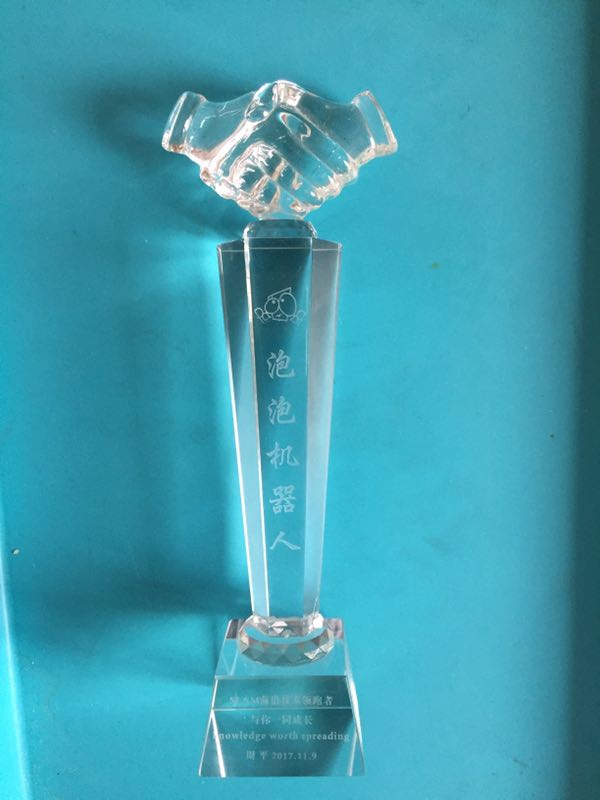
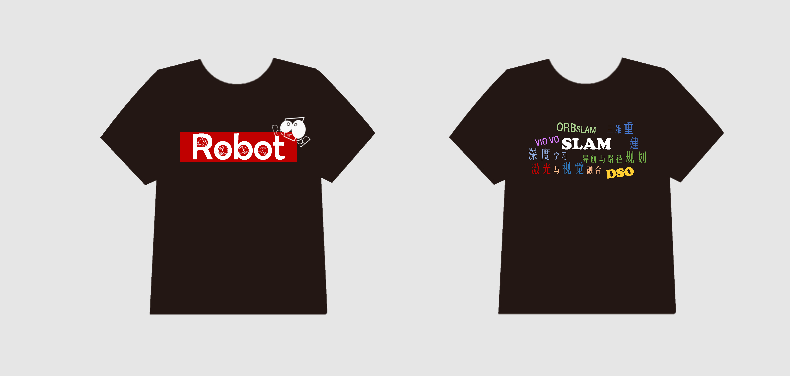
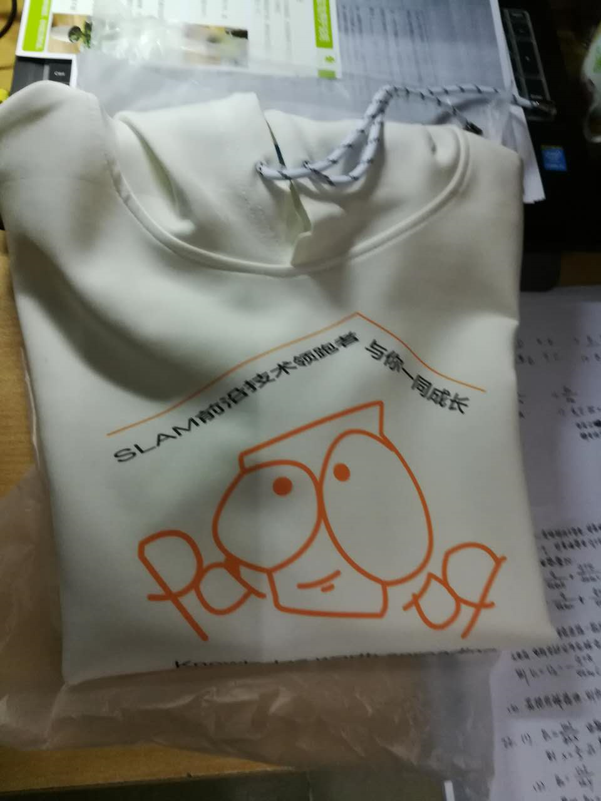
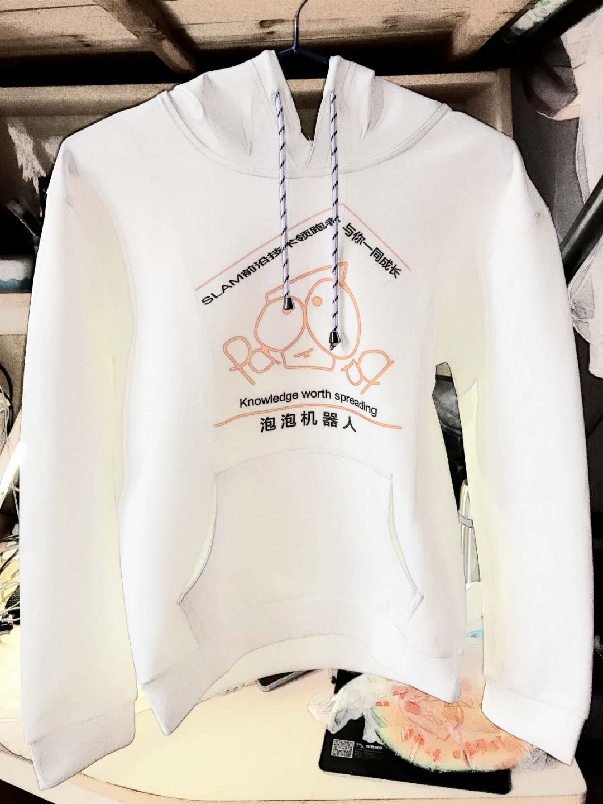
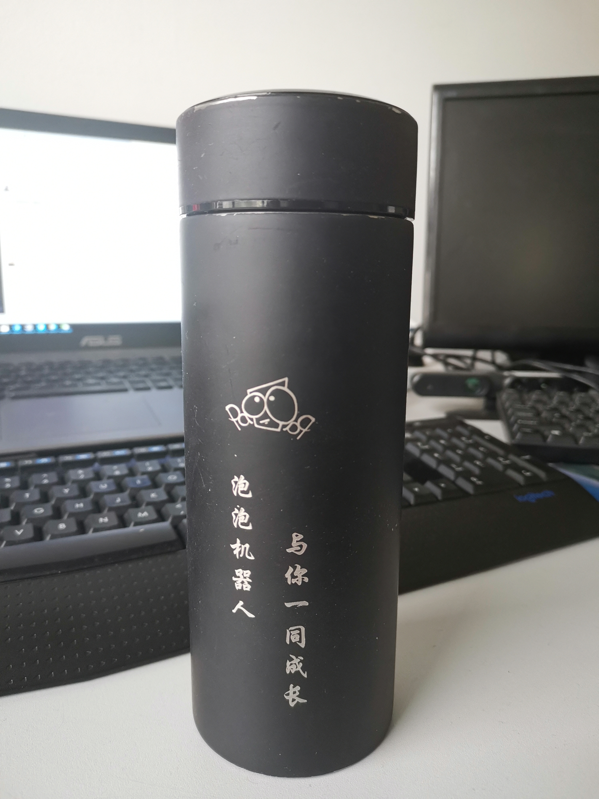
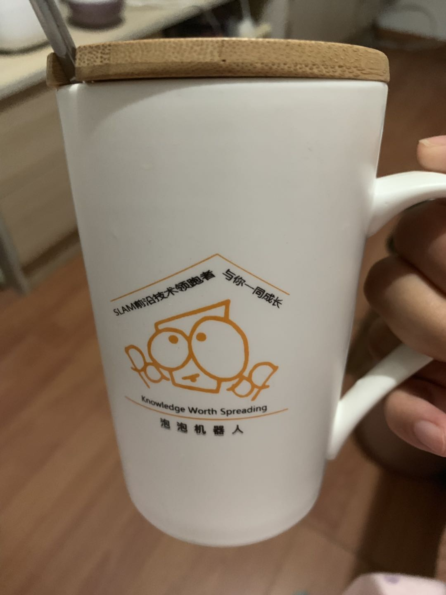
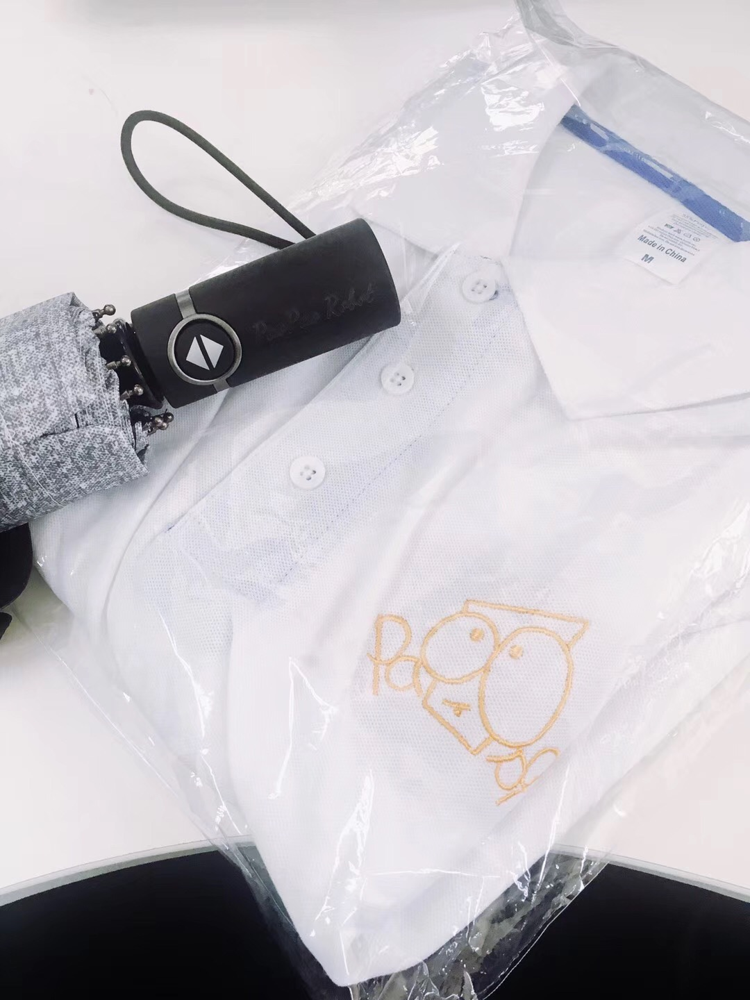
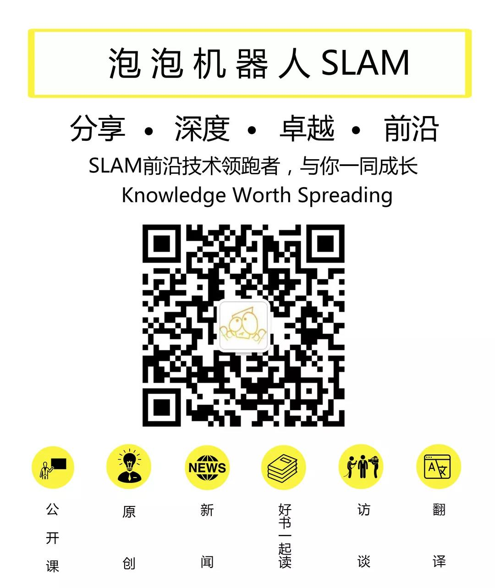
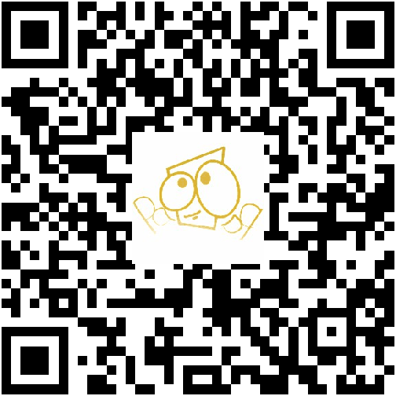

# PaoPaoRobotTutorial
首先热烈欢迎大家加入泡泡机器人大家庭！

---
# 泡泡机器人小组介绍（排名不分先后）
#### 【泡泡图灵智库】
    【泡泡图灵智库】栏目，是泡泡一分钟的深入解读版，旨在给读者带来更详细、更全面的阅读体验，我们希望能在短短的十分钟内便能让读者快速领略文章的核心内容，包括摘要、创新点、算法流程和结果分析。
    自成立之初以来，组员共计翻译了332篇精选论文，并在公众号上推送了231篇优秀文章，累计阅读量已达22w+。
    目前， 【泡泡图灵智库】仍在继续努力，搜罗各大顶级会议、期刊的优秀文章，为广大读者呈现最前沿的SLAM研究新动向。 

#### 【泡泡一分钟】
    顶级会议展示了当年的科研的发展方向和最新进展，是每位学者和相关从业人员不可缺少的学习机会。但是每年有大量的顶级会议召开（例如ICRA、IROS、ICCV、ECCV、CVPR等），并且每个会议又会有大量的论文（例如CVPR2019 1300篇）。
    如何从这么多论文中快速找到感兴趣的或有用的内容，是困扰每一位学者和相关从业人员的大难题！
    而泡泡一分钟就致力于解决该问题，我们从浩瀚的顶级会议中挑选出与“机器人”相关的论文，并进行摘要翻译，力求用最短的时间、最高的效率，为读者展示顶级会议的内容。每天只需要1分钟，即可掌握最新的研究动态。
    目前，泡泡一分钟双周更新，每周大致推送12篇论文；同时还会进行本周回顾，概要介绍本周的大致进展。

#### 【泡泡点云时空】
    泡泡点云时空致力于传播优秀的点云相关算法和应用。组内成员来自五湖四海，从事不同领域的点云研究，大家在泡泡平台上整理顶级期刊摘要，总结专业领域点云应用内容，分享给更多热爱科技人们，作为泡泡人，我们在分享中收获快乐，不断成长。

#### 【泡泡源代码组】
    泡泡源代码组致力于对经典开源slam方案进行剖析，从代码实现角度揭示SLAM算法的细节。
    
#### 【泡泡传感器评测组】
    对SLAM落地中涉及到的传感器进行评测，为大家推荐更多的实用的传感器信息，希望在SLAM技术进化的路上，起到一点点促进作用。

#### 【泡泡机器人公开课组】
    负责公开课的编辑和协助主讲人直播，时间安排会根据公开课的频率。
    公开课组过去致力于邀请知名大佬们给大家分享经验，也相信大佬们的分享多少也给大家科研路上的迷茫带来晨光。不过我们公开课组不希望仅限于此，我们希望能成为大家尽情交流和共同积攒经验的平台。在实际的研究过程中总会有各种坑等着我们去踩，但是我们希望“绝不被一个招式打败两次”。希望大家可以在泡泡公开课一点一滴分享自己的积累和经验，相信最后会汇成一笔巨大的财富让自己与后来人受益。
    同时泡泡公开课希望成为大家展示自己的平台，同学们、老师们或者工程师们可以在泡泡展现自己的实力，企业可以在泡泡展现自己的积淀。希望泡泡公开课未来能更多帮助到大家，和大家一起共同成长。
    广告：我们随时欢迎大家自荐或者推荐其他人来搞公开课！！！

#### 【泡泡搞事组】
    泡泡搞事组从成立至今，一直承担着论文整理，读者来稿等工作，为读者输出第一手的资料整理和优质的阅读资源。

#### 【泡泡新闻社】
    着眼于最新的技术资讯，搜集已有的解决方案，展望行业未来发展趋势，提供有观点的内容。

    大体分为新闻社、宣传设计、活动策划和协办。
    {新闻社}-A队和B队轮流负责一周，选取前沿或有趣的科技类新闻，每人翻译一部分，后统一审核编辑发布。
    {活动策划和协办}-线下活动的策划（比如去年的北京论剑）、与视频组一起制作周年纪念视频等。
    {宣传设计}-根据组织需求或活动需求，负责其他自媒体平台的推广维护和宣传设计，比如公众号卡片LOGO设计，公众号各专栏文章的编辑模板设计，线下活动北京论剑、黑客论坛的海报设计等。

#### 【泡泡播音组】
    我们是一分钟播音组，协助一分钟翻译组，让你每隔一周便能听见机器人顶级论文精华的提炼总结。只要你想，我们就在你耳边。

#### 【泡泡音视频组】
    我们是泡泡机器人的“喉舌”，我们掌握了泡泡机器人的“话语权”，我们是泡泡音视频组。

#### 【泡泡网站组】
    主要负责泡泡官网、泡泡论坛、泡泡论坛APP的维护。
    泡泡机器人论坛致力于为大家提供一个纯净、自由的交流平台。论坛目前共有17个版块，不仅包括SLAM、点云、自动驾驶等技术交流版块，期刊、会议点评与投稿经验分享版块，还提供了论文下载求助、数据集、传感器评测等互助服务。此外，论坛收录了泡泡机器人早期发布的公开课、原创文章等优质内容，方便大家查找与翻阅。为了保证回复质量，我们为每个版块邀请了具有丰富相关领域经验的泡芙来担任版主，他们与其他泡芙们已经共同为论坛贡献了百余条精彩的回答，欢迎大家前来访问和注册！
    [泡泡论坛网页版](http://paopaorobot.org/bbs)
    [泡泡论坛移动版](https://phpwind.aliyun.com/app/download?id=6094) (目前仅支持安卓)

#### 【泡泡线下学术组】

最后容我再啰嗦几句。泡泡机器人是个平台，大家有任何好的想法，比如想组织某个线上活动、比如想新增一个版块等，这些都可以随时提出，大家一块把想法实践！

---
# 泡泡机器人英雄榜
泡泡机器人现任成员：
#### 【泡泡图灵智库】
组长：蔡纪源、杨小育

组员：李永飞、尹双双、黄文超、皮燕燕、张晶、焦阳、张蕾、林瑞豪、李雨昊、万应才、李阳阳、凌勇、夏友杰、李鑫、李伟、杨宇超、谭艾琳、张珊珊

#### 【泡泡一分钟】
组长：颜青松、陈世浪

组员：明禹航，章绩伟，王丹，张宁，黄思宇，王嫣然，孙钦，张健，张鲁，倪志鹏，刘梦雅，马克，杨雨生，李健禹，王凯东，王少博，董文正，金顾敏，曹利浩，万裕林，陈诚，朱阳飞，王健，林旭滨。

#### 【泡泡点云时空】
组长：徐二帅

组员：巩雪萍，程枭，邹正，赵林，范蓉蓉，吕佳俊，田贵彬，黄玉玺，陈贝章，程淏，冯拓，吕琳，王炎，王宇杰，魏新，翁霆宇，易彤，周志

#### 【泡泡源代码组】
组长：邱笑晨

组员：

#### 【泡泡传感器评测组】
组长：周平

组员：

#### 【泡泡机器人公开课组】
组长：王琛、文聪聪

组员：游振兴，涂金戈，Amy，闵海根，朱英，赵江龙，杨帆，徐武民

#### 【泡泡搞事组】
组长：方宇

组员：王意茹，宋代伟，李新

#### 【泡泡新闻社】
组长：周艺

组员：张晨 叶楚培  试用期：孙太尉 曹鑫磊 张重群 高羽 那文杰

#### 【泡泡播音组】
组长：程枭、王晓鹏

组员：张倩妮（糯米）

#### 【泡泡音视频组】
组长：赵嘉珩

组员：刘征、孙雨嘉、赵江龙

#### 【泡泡网站组】
组长：刘剑锋、王超群

组员：

#### 【泡泡线下学术组】
组长：赵开勇

组员：

---
# 泡泡机器人现任荣誉组员
**王意茹**：现任泡泡搞事组成员，参与设计泡泡机器人三周年纪念文化衫，并且多次参与编辑泡泡纪念活动的文稿、排版。主持整理SLAM领域顶级会议文章链接。

**叶培楚**：现任泡泡新闻社成员，泡泡机器人的活跃分子和开心果，并积极参与泡泡机器人的推广和宣传。

**宋代伟**：现任泡泡搞事组成员，积极为泡泡运营提出宝贵的建议，并且多次主持整理SLAM顶级会议文章链接。

**游振兴**：泡泡机器人优秀专栏作者。

**陈冬梅**：泡泡机器人公开课组成员、泡泡机器人一分钟播音组组员，为泡泡机器人的推广和宣传做出过突出贡献。

---
# 泡泡机器人运营元老
**王超群**：泡泡机器人网站组组长，伟大想法的缔造者，泡泡机器人公众号、以及很多对泡泡机器人有重大作用的决策和建议都是超群提出的。

**张一**：前泡泡机器人推广组组长，全能手，曾经在各个组中都是明星成员，支持制作泡泡机器人一周年纪念视频，制定泡泡机器人公众号排版标准手册，主持组织泡泡机器人大型北京线下学术聚会。

**章国锋（教授）**：泡泡机器人早期成员，主持组织泡泡机器人大型杭州线下学术聚会。

**佘元博**：在非常早期的时候为泡泡机器人赞助了10000元启动资金，用来支持泡泡机器人的运营、及线下聚餐等活动。

**周聪**：泡泡机器人目前官方logo的设计者。

**吴博**：前泡泡机器人公开课组组长，邀请众多优秀的公开课组讲者。

**李平**：前泡泡机器人公开课组组长，制定泡泡机器人公开课邀请及协助中英文手册。

**蔡育展**：前泡泡机器人翻译组组长、图灵智库组组长。对泡泡机器人公众号的文章分类进行了精细的整理。
    
**许峰**：前泡泡机器人音视频组组长，主持制作泡泡机器人两周年纪念视频，参与制作泡泡机器人一周年纪念视频。

**周平**：前泡泡一分钟组长，现泡泡传感器评测组组长，个人实现成功转型，将泡泡一分钟团队带领成熟后，开发了新的泡泡版块。

**李敏乐**：前泡泡机器人点云时空组组长，支持创办了泡泡点云时空专栏，使得泡泡机器人的丰富性又像三维点云方向进行了扩展。

**吕佳俊**：前泡泡机器人点云时空组组长。

**赵林**：前泡泡机器人点云时空组组长。

**胡琪**：前泡泡机器人推广组组员，曾参与泡泡机器人的推广和艺术设计。

**徐礼达**：前泡泡机器人推广组组员，主持设计了泡泡机器人多款logo和宣传海报。

**王晓鹏**：现泡泡机器人一分钟播音组组长，泡泡一分钟播音组的创始人之一。

**刘畅**：前泡泡机器人一分钟播音组组长，泡泡一分钟播音组的创始人之一。

**郭晨**：前泡泡机器人一分钟播音组组长，泡泡一分钟播音组的创始人之一。

**四姑娘**：前泡泡机器人一分钟播音组组长，泡泡一分钟播音组的创始人之一。

**范帝楷**：前泡泡机器人优秀专栏作者，为泡泡机器人贡献了非常多的优秀原创SLAM技术文章。

**朱小英**：前泡泡机器人公开课组成员，为泡泡机器人的推广做出了大量的工作。

---
# 泡泡机器人曾经存在过的组
泡泡机器人访谈组

泡泡机器人好书一起读专栏

---
# 泡泡机器人第一届元老成员（按照入群的先后顺序）
PS：如果误将教师梯队的成员放入了学生梯队，可以联系我们尽快调整更新。

**教师梯队**：

王龙军，陈龙，黄山，维维，凌海滨，布树辉，章国锋，孙剑，戴玉超，谭平，沈邵劼，刘勇，黄国全，刘明，邹丹平，Laurent Kneip，苏昊。

**学生梯队**：

刘富强，侯涛，佘元博，黄耀，董超，高翔，肖锡臻，颜沁睿，张明明，陈昊升，杨俊，王超群，谢晓佳，贺一家，胡佳兴，吴博，冯兵，王京，姚二亮，刘毅，张也冬，曾书格，孙鑫，张颖，卿李，付兴银，刘浩敏，孙宇翔，吴天，郭玉峰，董靖，李平，周恺弟，柴政，郑帆，唐恒博，范帝楷，李济深，蒋佳忆，卢彦斌，张明，阎骥洲，赵季，周定富，戴忠欢，雷，李超，赵赫成，Wanda，金杉，刘敏，Stephane，李明杨，杨硕，Surya，杨楠，朱玉可，张腾，史皓天，敬巍，董世语，孙志明，赵亮，刘洪杰，曾志文，林一鸣，张林，马佳瑶，刘婉熙，陈尧，李建，吴侃之，余瑞，应高选，刘海伟，孙立晔，杨昭，李佳艺，张学彦，朱张豪，马庚宇，何安莉，邱强，赵开勇，任勇，杨盛，牟文杰，向学勤，费越，徐普，李博，姜飞俊，史信楚，侯晓辉，谭明朗，陈子冲，Mindey，杨绍武，Richard，栗陪良，秦通，杨振飞，孙刚，曹旭东，任少卿，原文帧，张帆，叶文凯，孔涛，谢国富，陈亮，申丽，万伟伟，朱全文，蔡锐，张弛，李志伟，毛宇，袁雷，单默，石培昊，文伟松，张家辉，张心欣，朱思语，周易，陈睿，朱锐，Yoyee。

---
# 泡泡机器人相关链接
1. [泡泡机器人官网](http://www.paopaorobot.org)
2. [泡泡论坛](http://www.paopaorobot.org/bbs)
3. [泡泡机器人bilibili主页](https://space.bilibili.com/38737757?from=search&seid=18339354462510546580)
4. [泡泡机器人公开课直播-斗鱼主页](https://www.douyu.com/1219482)
5. [泡泡机器人一周年纪念视频](https://v.qq.com/x/page/k03942mxceh.html)
6. [泡泡机器人两周年纪念视频](https://v.qq.com/x/page/e0762somgaa.html)
7. [泡泡机器人两周年纪念视频-AR版本](https://v.qq.com/x/page/c0761tq4ew5.html)

---
# 泡泡机器人大事记
#### 2016年4月10日，泡泡机器人正式成立
#### 2016年5月，泡泡机器人ORB-SLAM2注释版正式对外发布
#### 2016年6月，泡泡机器人微信公众号正式开通
#### 泡泡机器人通过斗鱼直播，正式开始周期性的公开课直播
#### 泡泡机器人公开课组正式成立
#### 泡泡机器人原创文章组正式成立
#### 泡泡机器人音视频处理组正式成立
#### 2017年3月，泡泡机器人推广内容组正式成立
#### 泡泡机器人网站正式上线
#### 泡泡机器人知乎、新浪、头条、简书等账号正式开通
#### 泡泡机器人bilibili、Youtube频道正式开通
#### 泡泡机器人一周年纪念视频正式上线
#### 泡泡机器人网站组正式成立
#### 泡泡机器人论坛正式上线
#### 泡泡机器人访谈组正式成立
#### 泡泡机器人翻译组正式成立
#### 泡泡机器人好书一起读组正式成立
#### 泡泡机器人大型线下学术聚会——杭州论剑
#### 泡泡机器人大型线下学术聚会——北京论剑
#### 泡泡机器人线下线上同步直播SLAM论坛——SLAM的现在与未来
#### 2017年3月，泡泡机器人对外公布第一个泡泡开源项目：[一锅粥SLAM（YGZ-SLAM）](https://github.com/PaoPaoRobot/ygz-slam)
#### 泡泡机器人好书一起读系列一【黄山老师带你学机器人状态估计】正式上线，并持续更新
#### 泡泡机器人好书一起读系列——【视觉SLAM十四讲】正式上线并持续更新
#### 2017年4月，泡泡机器人开放课题组正式成立
#### 2017年7月30日，泡泡新闻社正式成立
#### 泡泡一分钟正式成立，内容上线
#### 泡泡机器人搞事组正式成立
#### 泡泡点云时空正式上线
#### 泡泡机器人新加坡ICRA线下聚餐
#### 泡泡机器人北京线下聚餐
#### 泡泡机器人西安线下聚餐
#### 泡泡机器人香港线下聚餐
#### 泡泡机器人深圳线下聚餐
#### 泡泡机器人上海线下聚餐
#### 泡泡机器人点云时空正式上线
#### 泡泡机器人传感器评测组正式成立
#### 泡泡机器人源代码组正式成立
#### 2019年1月27日，泡泡机器人深圳线下聚餐
#### 2019年3月3日，泡泡机器人广州线下聚餐
#### 2019年4月24日，泡泡机器人公众号粉丝正式突破30000人大关
#### 2019年5月4日，泡泡机器人线下学术组正式成立

---
# 泡泡机器人定制版纪念品展示
#### 泡泡奖杯

#### 泡泡文化衫

#### 泡泡水杯

#### 泡泡雨伞

---
# 泡泡机器人介绍
泡泡机器人由一帮热爱探索并立志推广机器人同时定位与地图构建(SLAM)技术的极客创办而成，通过原创文章、公开课等方式分享SLAM领域的数学理论、编程实践和学术前沿。目前已经发展成为国内最大的以SLAM知识传播为主的知识共享以及产品研发平台。

泡泡机器人的目标是打造一个精英团体，在一个小范围的圈子内分享知识，激发创造的火花，立志于为推动中国机器人事业及SLAM做出自己的一点小小的贡献。 

中文名     : 泡泡机器人

外文名     : PaoPao Robot

成立时间 : 2016.04.10

团队口号 : SLAM前沿技术领跑者，与你一同成长(Knowledge Worth Spreading)

性质         : 知识传播，技术推广

创始人       : 刘富强

泡泡机器人微信公众号

泡泡论坛APP

